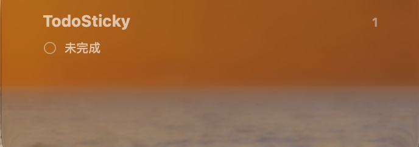

# TodoSticky

A lightweight native sticky note & todo app for macOS.<br>
一款轻量、原生的 macOS 桌面便签与待办应用，让重要的事情始终留在桌面上。

**Simple. Native. Always on your desktop.**

## Screenshots / 产品截图

<p align="center">
  
</p>

## Download / 下载

Latest release: **TodoSticky v0.2.0**

[Download TodoSticky](https://github.com/jasmin0828/TodoSticky/releases/latest)

The current release targets Apple Silicon (arm64) Macs. Download the DMG and move TodoSticky to **Applications**.

当前版本面向 Apple Silicon（arm64）Mac。下载 DMG 后，将 TodoSticky 拖入“应用程序 / Applications”。

## Features / 功能

- Desktop sticky notes / 桌面便签
- Create, complete, and delete todos / 创建、完成和删除待办
- Double-click editing / 双击编辑
- Sticky note colors / 多种便签颜色
- Dragging and resizing / 拖动与调整大小
- Native macOS Desktop Widget / 原生 macOS 桌面小组件
- Shared todo data between the App and Widget / App 与 Widget 共享待办数据
- Launch at Login / 登录时启动

## Desktop Widget / 桌面小组件

<p align="center">
  
</p>

TodoSticky v0.2.0 introduces a native macOS desktop Widget for Small and Medium widget sizes.

TodoSticky v0.2.0 新增原生 macOS 桌面小组件，支持 Small 和 Medium 尺寸，让待办无需打开主窗口也能保持可见。App 与 Widget 使用共享的本地待办数据。

## Installation / 安装

1. Download the latest DMG.
2. Open the DMG and move TodoSticky to **Applications**.
3. Launch TodoSticky and keep your todos on the desktop.

1. 下载最新 DMG。
2. 打开 DMG，将 TodoSticky 拖入“应用程序 / Applications”。
3. 启动 TodoSticky，让待办保持在桌面上。

## How to Use / 使用

1. Launch TodoSticky. / 启动 TodoSticky。
2. Add a todo. / 添加待办。
3. Double-click the title to edit it. / 双击标题进行编辑。
4. Mark it completed when finished. / 完成后将其标记为已完成。
5. Choose a sticky note color. / 选择便签颜色。
6. Drag or resize the sticky note on the desktop. / 在桌面上拖动或调整便签大小。
7. Add the TodoSticky Widget if needed. / 如有需要，添加 TodoSticky Widget。

## Privacy / 隐私

TodoSticky is local-first and does not require an account for its core todo functionality. In the v0.2.0 source, todo state and App/Widget coordination use local app support and App Group storage. No app-level network requests, account system, analytics, or telemetry implementation was found in the source inspected for this release.

TodoSticky 采用本地优先设计，核心待办功能无需注册账户。v0.2.0 源码中的待办状态与 App/Widget 协调使用本地应用支持目录和 App Group 存储。本次检查的源码未发现应用层网络请求、账户系统、分析或遥测实现。

## Build from Source / 从源码构建

The project uses Swift, SwiftUI, AppKit, WidgetKit, and ServiceManagement. The Xcode project currently declares a macOS 14.0 deployment target and Swift 6.0.

项目使用 Swift、SwiftUI、AppKit、WidgetKit 和 ServiceManagement。当前 Xcode 工程声明的 macOS 部署目标为 14.0，Swift 版本为 6.0。

```bash
git clone https://github.com/jasmin0828/TodoSticky.git
cd TodoSticky
```

Open `TodoSticky.xcodeproj` in Xcode and build the project.

使用 Xcode 打开 `TodoSticky.xcodeproj` 并执行 Build。

## Feedback / 反馈

Found a problem or have an idea? [Open an issue on GitHub](https://github.com/jasmin0828/TodoSticky/issues).

遇到问题或有改进建议？欢迎在 GitHub [提交 Issue](https://github.com/jasmin0828/TodoSticky/issues)。

## ☕ Support TodoSticky / 支持 TodoSticky

If TodoSticky is useful to you, you can support its continued development with a small crypto tip.

如果 TodoSticky 对你有所帮助，欢迎请开发者喝杯咖啡，支持项目继续更新。

**USDC on Base**

```text
0x82C87099A9E0BD148B32078766CDff26cDB5164d
```

Please make sure you are sending **USDC on the Base network**.
请确认使用 **Base 网络发送 USDC**，避免因网络选择错误造成资产损失。

## Releases / 版本

### v0.2.0

- Desktop Widget for Small and Medium sizes / 支持 Small 和 Medium 尺寸的桌面小组件
- Shared todo data between the App and Widget / App 与 Widget 共享待办数据
- English and Simplified Chinese Widget localization / Widget 支持英文和简体中文
- Widget language follows the App preference / Widget 语言跟随 App 偏好设置
- Launch at Login / 登录时启动

### v0.1.0

- First public macOS release / 首个公开 macOS 版本
- Create, complete, edit, and delete todos / 创建、完成、编辑和删除待办
- Inline todo editing and native macOS interface / 内联编辑与原生 macOS 界面
- Apple Silicon (arm64) distribution / Apple Silicon（arm64）发行版

## License / 许可证

No `LICENSE`, `LICENSE.md`, or `COPYING` file is currently included in this repository.

当前仓库未包含 `LICENSE`、`LICENSE.md` 或 `COPYING` 文件。
